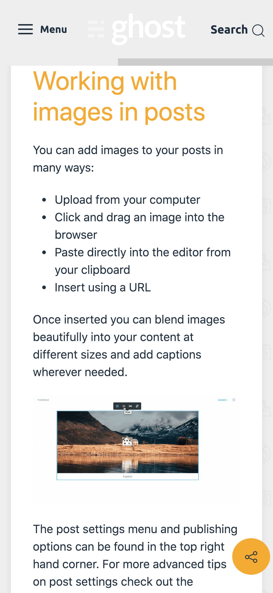
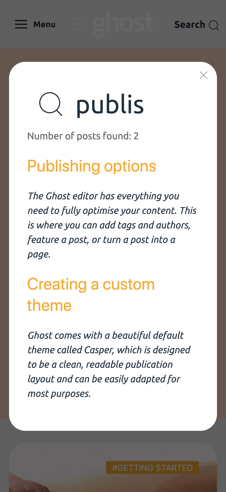

# Nice and free Ghost Theme

Free [Ghost](https://ghost.org/) blogging platform theme available to download (zip)

## Install
1. Unzip the file
2. Place it in Ghost's following location content/themes
3. In Ghost settings, go to the design section and set this theme to active

## Edit
There is a readme file with source and indications for edit.

## Screenshots

